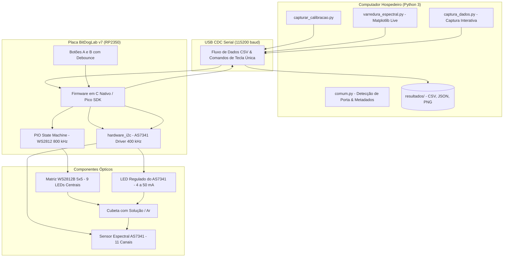

# AS7341 — Sistema de Sensoriamento Espectral Multicanal e Caracterização Óptica na BitDogLab v7

Projeto de Iniciação Científica focado no desenvolvimento de instrumentação optoeletrônica para **análise espectral de soluções químicas com diferentes pHs** (ácido, neutro e alcalino), **caracterização radiométrica de fontes de iluminação RGB** e **varredura espectral automatizada** utilizando o sensor de 11 canais **ams OSRAM AS7341** acoplado à placa educacional **BitDogLab v7** (Raspberry Pi Pico 2 W / RP2350).

---

## Sumário

- [Visão Geral](#visão-geral)
- [Arquitetura do Sistema](#arquitetura-do-sistema)
- [Hardware e Pinagem](#hardware-e-pinagem)
- [Estrutura do Repositório](#estrutura-do-repositório)
- [Subsistema de Firmware](#subsistema-de-firmware)
  - [Aplicativos (`firmware/apps/`)](#aplicativos-firmwareapps)
  - [Driver do Sensor (`firmware/drivers/`)](#driver-do-sensor-firmwaredrivers)
  - [Programa PIO WS2812B (`firmware/pio/`)](#programa-pio-ws2812b-firmwarepio)
- [Subsistema de Scripts Python](#subsistema-de-scripts-python)
- [Organização dos Resultados](#organização-dos-resultados)
- [Especificações e Configuração do Sensor](#especificações-e-configuração-do-sensor)
- [Como Compilar e Gravar](#como-compilar-e-gravar)
- [Como Executar os Experimentos](#como-executar-os-experimentos)
  - [1. Calibração e Caracterização Óptica](#1-calibração-e-caracterização-óptica)
  - [2. Varredura Espectral Automatizada](#2-varredura-espectral-automatizada)
  - [3. Ensaios com Soluções de pH](#3-ensaios-com-soluções-de-ph)
- [Repositório Histórico](#repositório-histórico)

---

## Visão Geral

O sistema combina uma fonte de luz colimada programável (formada pelos 9 LEDs centrais de uma matriz 5×5 de LEDs WS2812B e pelo LED acoplado ao sensor) com o fotodetector espectral AS7341.

O fluxo de operação geral segue os passos:
1. Uma cubeta óptica com a amostra líquida (ou ar como referência) é posicionada entre a matriz de LEDs e o sensor.
2. A placa BitDogLab aciona a fonte de iluminação em comprimentos de onda selecionados e dispara medições através do barramento I2C1 (400 kHz).
3. O sensor AS7341 executa dois ciclos de multiplexação (SMUX) para amostrar os 10 canais espectrais (F1–F8, Clear e NIR).
4. As medições brutas são enviadas via USB Serial em formato CSV estruturado.
5. Scripts Python no computador capturam as leituras, salvam conjuntos de dados com metadados em JSON e geram gráficos de absorbância e transmissão espectral.

---

## Arquitetura do Sistema



---

## Hardware e Pinagem

Conexões físicas na placa **BitDogLab v7**:

| Sinal / Linha | GPIO | Configuração | Descrição |
|---|---|---|---|
| **I2C1 SDA** | GPIO 2 | Pull-up | Linha serial de dados do sensor AS7341 |
| **I2C1 SCL** | GPIO 3 | 400 kHz | Linha serial de clock do sensor AS7341 |
| **WS2812** | GPIO 7 | PIO0 (SM0) | Linha serial de dados da matriz 5×5 de LEDs |
| **Botão A** | GPIO 5 | Pull-up interno | Ativo em nível lógico BAIXO (muda cor da iluminação) |
| **Botão B** | GPIO 6 | Pull-up interno | Ativo em nível lógico BAIXO (dispara leitura pontual) |
| **VCC** | 3.3V | Barramento de 3.3V | Alimentação do sensor AS7341 |
| **GND** | GND | Referência comum | Terra compartilhado |

---

## Estrutura do Repositório

O projeto é estruturado de forma modular, com documentação dedicada em cada subsistema:

```
a734x_test/
├── CMakeLists.txt            # Configuração de build CMake para Pico SDK (RP2350)
├── pico_sdk_import.cmake     # Importação do Pico SDK
├── PROJECT_LAYOUT.md         # Sumário rápido da estrutura de diretórios
├── README.md                 # Este documento principal
│
├── firmware/                 # [README] Subsistema embarcado para RP2350
│   ├── apps/                 # [README] Aplicações executáveis (varredura, pH, calibração)
│   │   ├── a734x_test.c
│   │   └── caracterizacao_optica.c
│   ├── drivers/              # [README] Driver C do sensor AS7341
│   │   ├── as7341.h
│   │   └── as7341.c
│   └── pio/                  # [README] Programa PIO para matriz WS2812B
│       └── ws2812.pio
│
├── scripts/                  # [README] Scripts Python de captura e visualização
│   ├── comum.py              # Biblioteca compartilhada (portas, caminhos, JSON)
│   ├── calibracao/           # [README] Automação de calibração fotométrica
│   │   └── capturar_calibracao.py
│   ├── varredura/            # [README] Varredura espectral e gráficos em tempo real
│   │   └── varredura_espectral.py
│   ├── ph/                   # [README] Ensaios interativos com soluções de pH
│   │   └── captura_dados.py
│   └── legado/               # [README] Scripts históricos preservados
│       └── varredura_espectral_antigo.py
│
├── resultados/               # [README] Diretório centralizado de dados experimentais
│   ├── calibracao/           # Ensaios de calibração (41 condições × 5 réplicas)
│   ├── varredura/            # Varreduras espectrais (vazio, meia_agua, cheio)
│   └── ph/                   # Medições em soluções ácidas, neutras e básicas
│
└── as7341_ph_test/           # [README] Repositório Git histórico preservado intacto
```

---

## Subsistema de Firmware

Consulte a documentação completa em [firmware/README.md](file:///c:/Users/luana/Documents/IC/a7341/a734x/a734x_test/firmware/README.md).

### Aplicativos ([`firmware/apps/`](file:///c:/Users/luana/Documents/IC/a7341/a734x/a734x_test/firmware/apps/README.md))

1. **`a734x_test.c`**:
   - Varredura espectral automatizada através de 8 cores (Violeta, Índigo, Azul, Ciano, Verde, Amarelo, Laranja e Vermelho).
   - Modo de teste de pH com comandos instantâneos via serial (`a` = ácido, `n` = neutro, `b` = base).
   - Controle dinâmico da matriz WS2812B (9 LEDs centrais) e do LED integrado do AS7341 (4 a 50 mA).
   - Comandos seriais: `v` (varredura), `p` (leitura pontual), `m` (liga/desliga matriz), `l` (liga/desliga LED sensor), `+`/`-`/`i` (corrente do LED), `s` (status), `r` (reset).

2. **`caracterizacao_optica.c`**:
   - Protocolo de calibração sistemática com **41 condições ópticas**:
     - 10 níveis de Vermelho puro (0 a 255)
     - 10 níveis de Verde puro (0 a 255)
     - 10 níveis de Azul puro (0 a 255)
     - 11 misturas e níveis de branco (Escuro, Amarelo, Ciano, Magenta, Brancos 25% a 100%)
   - 5 réplicas por condição = 205 medições por execução.

### Driver do Sensor ([`firmware/drivers/`](file:///c:/Users/luana/Documents/IC/a7341/a734x/a734x_test/firmware/drivers/README.md))

- Implementado em C nativo com `hardware_i2c` a 400 kHz.
- Sequenciamento do multiplexador interno **SMUX** em duas fases para leitura dos 11 fotodiodos com os 6 ADCs internos.
- Controle configurável de ganho (0.5× a 512×) e tempos de integração (`ATIME`, `ASTEP`).
- Controle por hardware da fonte de corrente do pino LDR (LED integrado do sensor).

### Programa PIO WS2812B ([`firmware/pio/`](file:///c:/Users/luana/Documents/IC/a7341/a734x/a734x_test/firmware/pio/README.md))

- Programa em assembly PIO (`ws2812.pio`) que gera os pulsos de temporização de 800 kHz por hardware, com zero sobrecarga de processamento para a CPU do RP2350.

---

## Subsistema de Scripts Python

Consulte a documentação completa em [scripts/README.md](file:///c:/Users/luana/Documents/IC/a7341/a734x/a734x_test/scripts/README.md).

Todos os scripts utilizam o módulo compartilhado [scripts/comum.py](file:///c:/Users/luana/Documents/IC/a7341/a734x/a734x_test/scripts/comum.py) e suportam detecção automática da porta COM da Pico (VID `0x2E8A`):

- **Calibração**: [scripts/calibracao/capturar_calibracao.py](file:///c:/Users/luana/Documents/IC/a7341/a734x/a734x_test/scripts/calibracao/README.md)
- **Varredura**: [scripts/varredura/varredura_espectral.py](file:///c:/Users/luana/Documents/IC/a7341/a734x/a734x_test/scripts/varredura/README.md)
- **Testes de pH**: [scripts/ph/captura_dados.py](file:///c:/Users/luana/Documents/IC/a7341/a734x/a734x_test/scripts/ph/README.md)
- **Legado**: [scripts/legado/varredura_espectral_antigo.py](file:///c:/Users/luana/Documents/IC/a7341/a734x/a734x_test/scripts/legado/README.md)

---

## Organização dos Resultados

Consulte a documentação completa em [resultados/README.md](file:///c:/Users/luana/Documents/IC/a7341/a734x/a734x_test/resultados/README.md).

Toda execução cria um diretório padronizado com timestamp e parâmetros:
```
resultados/<experimento>/<AAAAMMDD_HHMMSS>__<configuracao>/
├── dados.csv     # Leituras espectrais brutas
├── config.json   # Parâmetros de iluminação, ganho e portas
└── grafico.png   # Gráficos espectrais gerados (ensaios de varredura)
```

---

## Especificações e Configuração do Sensor

### Canais Espectrais do AS7341

| Canal | Comprimento de Onda Central | Faixa Espectral |
|---|---|---|
| **F1** | 415 nm | Violeta |
| **F2** | 445 nm | Índigo / Azul escuro |
| **F3** | 480 nm | Azul |
| **F4** | 515 nm | Ciano / Verde-água |
| **F5** | 555 nm | Verde |
| **F6** | 590 nm | Amarelo |
| **F7** | 630 nm | Laranja |
| **F8** | 680 nm | Vermelho |
| **Clear** | Espectro visível amplo | Branco / Não filtrado |
| **NIR** | ~910 nm | Infravermelho Próximo |

### Parâmetros de Integração Adotados

| Parâmetro | Valor Configurado | Significado |
|---|---|---|
| **ATIME** | 100 | Passos base de integração |
| **ASTEP** | 999 | Largura de cada passo (unidades de 2,78 µs) |
| **Ganho (AGAIN)** | 8× | Fator de amplificação analógica |
| **Tempo por ciclo** | ~280 ms | $(100 + 1) \times (999 + 1) \times 2{,}78\,\mu\text{s} \approx 280{,}8\,\text{ms}$ |
| **I2C Clock** | 400 kHz | Modo Fast-mode |

---

## Como Compilar e Gravar

### Pré-requisitos
- **Raspberry Pi Pico SDK** (versão 2.3.0 ou superior instalada).
- **CMake** (3.13+) e compilador **ARM GCC** (`arm-none-eabi-gcc`).
- **Python 3** com `pyserial`, `matplotlib` e `numpy`.

### 1. Compilação do Firmware

No terminal (PowerShell ou Bash) na raiz do projeto:

```powershell
# Configurar o projeto com CMake e gerador Ninja
cmake -B build -G "Ninja"

# Compilar todos os executáveis
cmake --build build
```

Os arquivos compilados gerados serão:
- `build/a734x_test.uf2`
- `build/caracterizacao_optica.uf2`

### 2. Gravação na Placa

1. Mantenha pressionado o botão **BOOTSEL** da BitDogLab (ou Raspberry Pi Pico 2 W).
2. Conecte o cabo USB ao computador (a placa será montada como unidade de disco removível).
3. Copie o arquivo `.uf2` desejado para a unidade. A placa reiniciará automaticamente.

---

## Como Executar os Experimentos

> [!IMPORTANT]
> Apenas um aplicativo pode usar a porta serial por vez. Feche monitores seriais (VS Code Serial Monitor, PuTTY, etc.) antes de iniciar os scripts.

### 1. Calibração e Caracterização Óptica

Grave `build/caracterizacao_optica.uf2` e execute:

```powershell
# Matriz ligada, LED do sensor desligado
py scripts/calibracao/capturar_calibracao.py

# Apenas o LED integrado do sensor em 20 mA (matriz desligada)
py scripts/calibracao/capturar_calibracao.py --sem-matriz --led-ma 20

# Com matriz e LED a 10 mA com rótulo
py scripts/calibracao/capturar_calibracao.py --led-ma 10 --rotulo cubeta_vazia
```

### 2. Varredura Espectral Automatizada

Grave `build/a734x_test.uf2` e execute:

```powershell
# Varredura com cubeta cheia (matriz ligada)
py scripts/varredura/varredura_espectral.py --rotulo cheio

# Varredura com cubeta cheia e LED do sensor em 20 mA
py scripts/varredura/varredura_espectral.py --rotulo cheio --led-ma 20

# Varredura de cubeta vazia apenas com LED do sensor a 20 mA
py scripts/varredura/varredura_espectral.py --rotulo vazio --sem-matriz --led-ma 20
```

### 3. Ensaios com Soluções de pH

Grave `build/a734x_test.uf2` e execute:

```powershell
py scripts/ph/captura_dados.py ensaio_ph_completo
```

Durante o ensaio:
- Use `a` (ácido), `n` (neutro) e `b` (base) no teclado do computador.
- Pressione o **Botão B** na BitDogLab para realizar cada medição pontual.
- Pressione `q` no computador para salvar e encerrar.

---

## Repositório Histórico

O diretório [as7341_ph_test/](file:///c:/Users/luana/Documents/IC/a7341/a734x/a734x_test/as7341_ph_test/README.md) é mantido intacto como arquivo histórico das fases preliminares do projeto, assegurando rastreabilidade científica e integridade do histórico Git original.
