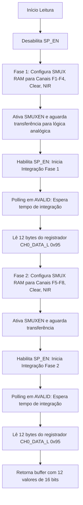

# Módulo Drivers — Driver AS7341 para Raspberry Pi Pico SDK

Este diretório contém o driver em C nativo para o sensor espectral de 11 canais **ams OSRAM AS7341**, desenvolvido sem dependências externas além dos módulos padrão do Pico SDK (`pico/stdlib.h` e `hardware/i2c.h`).

---

## Arquivos

- [as7341.h](file:///c:/Users/luana/Documents/IC/a7341/a734x/a734x_test/firmware/drivers/as7341.h) — Interface pública, definições de registradores, enums de ganho e protótipos de funções.
- [as7341.c](file:///c:/Users/luana/Documents/IC/a7341/a734x/a734x_test/firmware/drivers/as7341.c) — Implementação dos acessos I2C, sequenciamento SMUX, temporização e leitura dos ADCs.

---

## Características do AS7341

O **AS7341** é um sensor espectral multicanal de alta sensibilidade com fotodiodos organizados em faixas específicas do espectro visível e infravermelho próximo (NIR), além de canais para detecção de cintilação (Flicker) e luz ambiente desprovida de filtro (Clear):

| Canal | Comprimento de Onda Central | Cor / Região |
|---|---|---|
| **F1** | 415 nm | Violeta |
| **F2** | 445 nm | Azul escuro (Índigo) |
| **F3** | 480 nm | Azul |
| **F4** | 515 nm | Ciano / Verde-água |
| **F5** | 555 nm | Verde |
| **F6** | 590 nm | Amarelo |
| **F7** | 630 nm | Laranja |
| **F8** | 680 nm | Vermelho |
| **Clear** | Espectro visível amplo | Branco / Não filtrado |
| **NIR** | ~910 nm | Infravermelho Próximo |

---

## Arquitetura Interna e Operação do SMUX

O sensor possui **11 fotodiodos físicos**, porém apenas **6 conversores analógico-digitais (ADCs)** de 16 bits internos. Por isso, a leitura completa dos 10 canais espectrais é realizada através do multiplexador interno chamado **SMUX (Super Multiplexer)** em duas fases sucessivas:

### Configurações de SMUX

1. **Canais Baixos (F1–F4)**:
   - ADC 0: F1 (415 nm)
   - ADC 1: F2 (445 nm)
   - ADC 2: F3 (480 nm)
   - ADC 3: F4 (515 nm)
   - ADC 4: Clear
   - ADC 5: NIR
2. **Canais Altos (F5–F8)**:
   - ADC 0: F5 (555 nm)
   - ADC 1: F6 (590 nm)
   - ADC 2: F7 (630 nm)
   - ADC 3: F8 (680 nm)
   - ADC 4: Clear
   - ADC 5: NIR

---

## Tempo de Integração e Ganho

### Cálculo do Tempo de Integração

O tempo de amostragem espectral é configurado por dois parâmetros de 8 e 16 bits:
- **`ATIME`** (0 a 255): Contador de ciclos base.
- **`ASTEP`** (0 a 65534): Largura de passo de integração em unidades de 2,78 µs.

A duração total da integração analógica é dada pela equação do datasheet ams OSRAM:
$$t_{\text{int}} = (\text{ATIME} + 1) \times (\text{ASTEP} + 1) \times 2{,}78\,\mu\text{s}$$

No projeto padrão, são adotados:
- $\text{ATIME} = 100$
- $\text{ASTEP} = 999$
- $t_{\text{int}} \approx (101) \times (1000) \times 2{,}78\,\mu\text{s} \approx 280{,}78\,\text{ms}$ por ciclo SMUX.

### Ganho Analógico (AGAIN)

O registrador `CFG1` (endereço `0xAA`) controla o ganho dos amplificadores transimpedância analógicos:
- `AS7341_GAIN_0_5X` (0.5×) até `AS7341_GAIN_512X` (512×).
- Padrão utilizado nas medidas: **8×** (`AS7341_GAIN_8X`).

---

## Controle do LED de Iluminação Integrado ao Sensor

O chip AS7341 possui uma fonte interna de corrente programável conectada ao pino `LDR`:
- Corrente configurável de **4 mA a 258 mA** em passos de 2 mA:
  $$\text{Corrente} = 4\,\text{mA} + (\text{CURRENT\_VAL} \times 2\,\text{mA})$$
- Por segurança térmica e durabilidade do LED da placa auxiliar, o software restringe a faixa segura a um máximo configurável (padrão de até **50 mA**).
- Funções da API:
  - `as7341_enable_led(&sensor, bool enable)`
  - `as7341_set_led_current(&sensor, uint16_t current_ma)`

---

## Resumo das Funções da API C

| Função | Descrição |
|---|---|
| `as7341_init(dev, i2c, addr)` | Inicializa I2C, verifica o `WHOAMI` (`0x09`), reseta e liga o dispositivo (`PON`). |
| `as7341_set_atime(dev, atime)` | Define o registrador `ATIME` para controle de tempo de integração. |
| `as7341_set_astep(dev, astep)` | Define os registradores `ASTEP_L` e `ASTEP_H`. |
| `as7341_set_gain(dev, gain)` | Define o ganho analógico `AGAIN` nos bits [4:0] do registrador `CFG1`. |
| `as7341_read_all_channels(dev, readings)` | Executa a sequência SMUX de duas etapas e popula um array com 12 inteiros `uint16_t`. |
| `as7341_enable_led(dev, enable)` | Liga ou desliga a fonte de corrente do pino LDR. |
| `as7341_set_led_current(dev, current_ma)` | Programa o registrador `LED` com a corrente desejada em miliamperes. |
